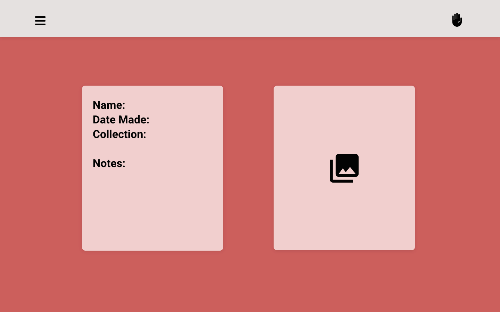

# Jazz Hands, ASLexicon/ASLex?

- [**LINK TO FRONTEND GITHUB**](https://github.com/aubreyrobillard/capstone-frontend)
- [**LINK TO BACKEND GITHUB**](https://github.com/aubreyrobillard/capstone-backend)
- [**LINK TO DEPLOYED WEBSITE**]()
- [**LINK TO TRELLO**](https://trello.com/b/h64lB9bg/capstone-project)

**List of technologies used:**
- Django, *Svelte*, Python, Sequel, CSS

## About the App

(insert decided app name here) app was designed with those learning sign language in mind. With the app, users can upload photos or videos of the hand signs they've learned along with some basic information including the word or phrase the sign translates to, how/when to use the sign while communicating, and a space to jot down a few notes; for instace: "CAUTION when signing *speak* make sure to spread your fingers! Open fingers translates to *b!tch*... Learned the hard way.." 

The app also has the option to use the search bar to quickly locate a desired sign. No more are the days of desperately prowling google to find signs of everyday words!

## About the Developer

Aubrey created this app while enrolled in a strenuous six-month software engineering bootcamp through General Assembly. For more about the developer and to see her other projects, check out the link below!

- [Aubrey Robillard](https://www.linkedin.com/in/aubreyrobillard/)

(add portfolio link?)

## Mock Up:

## List of Backend Endpoints:

| ENDPOINT          | METHOD | PURPOSE                     |
| ------------------| ------ | ----------------------------|
| /                 | GET    |  render all sign cards      |
| /sign/:id         | GET    | render a single sign card   |
| /sign/:id/update  | POST   | make changes to a sign card |
| /sign/create      | POST   | create a new sign card      |
| /sign/:id/delete  | DELETE |  delete a sign card         |

## ERD (entitity relationship diagram):

made with https://app.smartdraw.com/

## Future Enhancements:

