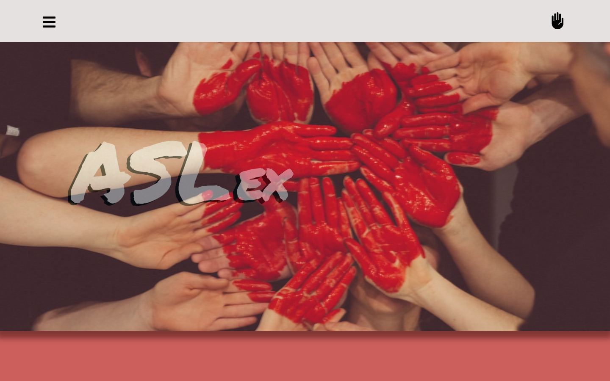
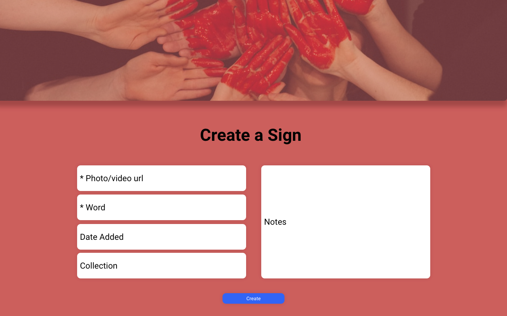
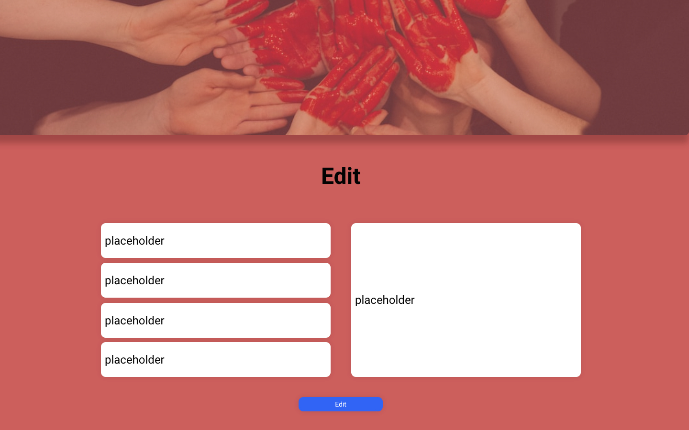
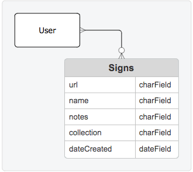

# ASLex

- [**LINK TO FRONTEND GITHUB**](https://github.com/aubreyrobillard/capstone-frontend)
- [**LINK TO BACKEND GITHUB**](https://github.com/aubreyrobillard/capstone-backend)
- [**LINK TO DEPLOYED WEBSITE**](https://capstonefrontend-okww.onrender.com)
- [**LINK TO TRELLO**](https://trello.com/b/h64lB9bg/capstone-project)

**List of technologies used:**
- Django, *Svelte*, Python, Sequel, CSS, Vite

## About the App

ASLex app was designed with those learning sign language in mind. With the app, users can upload photos or videos of the hand signs they've learned along with some basic information including the word or phrase the sign translates to, and a space to jot down a few notes; for instace: "CAUTION when signing *speak* make sure to spread your fingers! Open fingers translates to *b!tch*... Learned the hard way.." 

## About the Developer

Aubrey created this app while enrolled in a strenuous six-month software engineering bootcamp through General Assembly. For more about the developer and to see her other projects, check out the link below!

- [Aubrey Robillard](https://www.linkedin.com/in/aubreyrobillard/)

## Mock Up:

## List of Backend Endpoints:

| ENDPOINT          | METHOD | PURPOSE     |
| ------------------| ------ | ------------|
| /signs            | GET    | Full CRUD   |

## ERD (entitity relationship diagram):

made with https://app.smartdraw.com/

## Future Enhancements:
- In order to create a better user experience, I will be adding functions that enable the edit form to be rendered only for the sign being updated.
- A user sear bar/filter feature to search sign cards by name, id, date-created, etc..
- Camera/audio API to allow users to record photos/videos to input into the app while inside of the app. 

